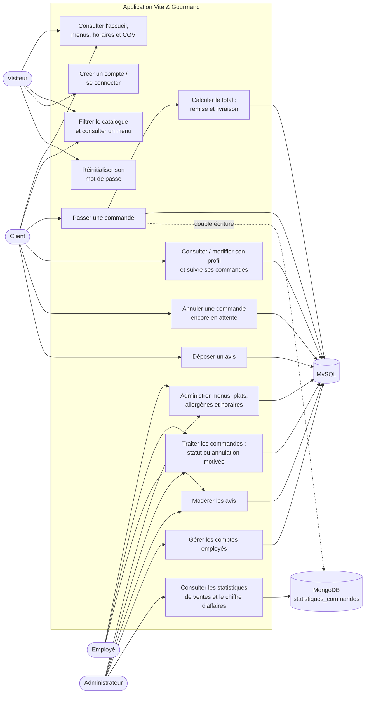
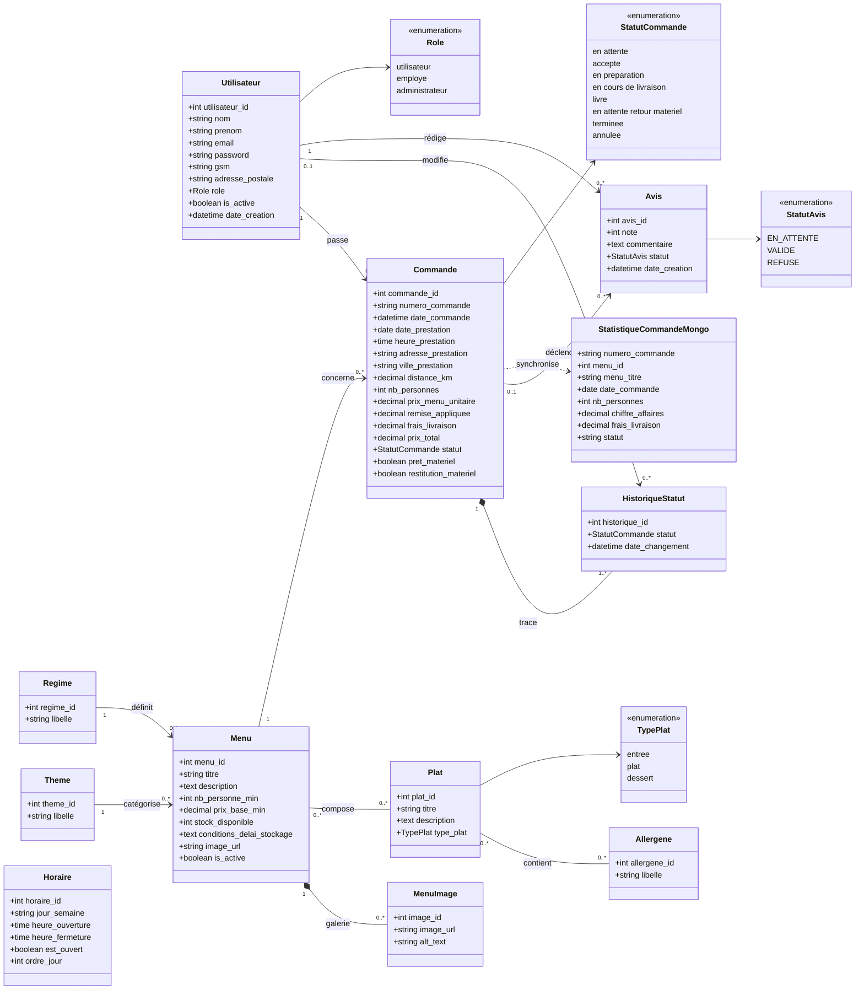

# Diagrammes UML — Vite & Gourmand

Ces diagrammes sont écrits en [Mermaid](https://mermaid.js.org/). Ils peuvent être affichés directement dans GitHub, GitLab, VS Code avec une extension Mermaid, ou copiés dans Mermaid Live Editor.

## Diagramme fonctionnel — cas d'utilisation

Règles métier portées par le parcours de commande : livraison gratuite à Bordeaux ; sinon `5,00 € + 0,59 €/km` ; remise de 10 % à partir du minimum du menu + 5 personnes. Toute commande crée un historique initial `en attente` et une entrée MongoDB destinée aux statistiques.

## Diagramme de classes — modèle métier et persistance

Les relations `Menu–Plat` et `Plat–Allergène` sont des associations plusieurs-à-plusieurs, implémentées en MySQL par les tables de liaison `menu_plat` et `plat_allergene`. `StatistiqueCommandeMongo` est un document dénormalisé, créé lors de l'enregistrement d'une commande, et non une table relationnelle.
